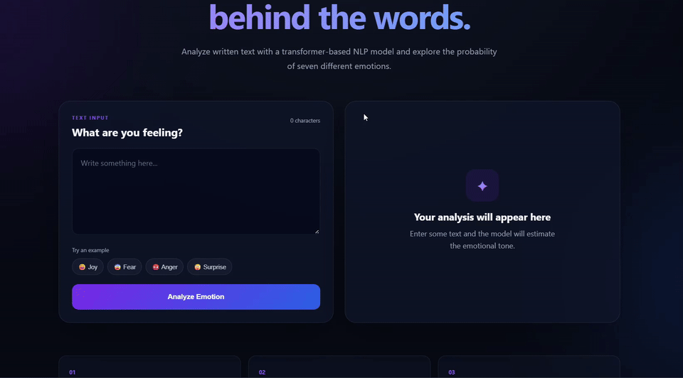
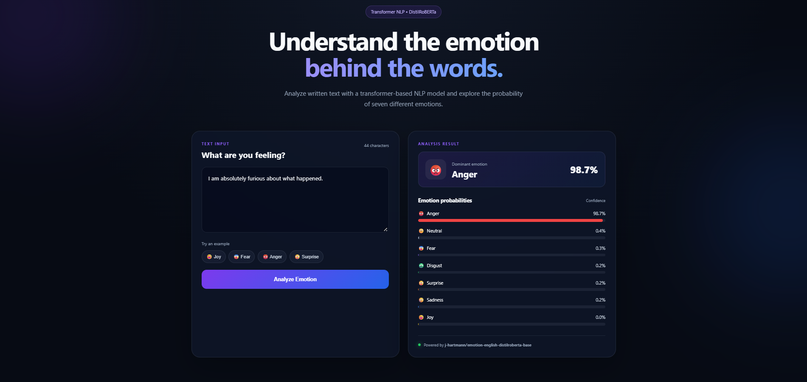

# Emotion Intelligence

[](https://github.com/Syedfakhir03/emotion-intelligence-web-app/actions/workflows/tests.yml)


A transformer-based NLP web application that detects the emotional tone of English text using **DistilRoBERTa**.  
The app returns probabilities for **seven emotions** through a Flask REST API and visualizes the result in a responsive interactive dashboard.

---

## Demo



---

## Application Preview



---

## What It Does

Emotion Intelligence analyzes a piece of text and estimates the probability of seven emotion classes:

- **Anger**
- **Disgust**
- **Fear**
- **Joy**
- **Neutral**
- **Sadness**
- **Surprise**

The highest-scoring class is shown as the **dominant emotion**, while the complete probability distribution is displayed using animated confidence bars.

---

## Key Features

- Transformer-based emotion classification
- Seven-class emotion probability output
- Flask REST API using `POST /api/analyze`
- Local model inference after the model is cached
- Interactive and responsive JavaScript frontend
- Animated emotion probability bars
- Dominant-emotion summary card
- Example prompts for quick testing
- Input validation and user-friendly error handling
- Unit tests for the emotion service
- API and route tests for the Flask application
- GitHub Actions CI on pushes and pull requests
- Production WSGI entry point with Gunicorn support

---

## Architecture

```text
User
 │
 ▼
JavaScript Frontend
 │
 │  POST /api/analyze
 ▼
Flask REST API
 │
 ▼
Emotion Service
 │
 ▼
DistilRoBERTa Transformer
 │
 ▼
7 Emotion Probabilities
 │
 ▼
JSON Response
 │
 ▼
Interactive Result Dashboard
```

The model is loaded once and reused for later predictions. The application checks the local Hugging Face cache first and downloads the public model only when it is not already available.

---

## Tech Stack

| Area | Technology |
| --- | --- |
| Machine Learning | DistilRoBERTa, Hugging Face Transformers, PyTorch |
| Backend | Python, Flask |
| API | REST / JSON |
| Frontend | HTML, CSS, JavaScript |
| Testing | Python `unittest`, `unittest.mock` |
| CI | GitHub Actions |
| Production Server | Gunicorn |
| Model Source | Hugging Face Hub |

---

## Model

The application uses:

```text
j-hartmann/emotion-english-distilroberta-base
```

Predicted classes:

```text
anger
disgust
fear
joy
neutral
sadness
surprise
```

---

## REST API

### Endpoint

```http
POST /api/analyze
```

### Example Request

```json
{
  "text": "I can't believe we actually won!"
}
```

### Example Response

```json
{
  "success": true,
  "text": "I can't believe we actually won!",
  "dominant_emotion": "surprise",
  "emotions": {
    "anger": 0.012,
    "disgust": 0.002,
    "fear": 0.002,
    "joy": 0.011,
    "neutral": 0.004,
    "sadness": 0.003,
    "surprise": 0.966
  }
}
```

> Scores are probabilities produced by the model and will vary depending on the input.

---

## Run Locally

### 1. Clone the repository

```bash
git clone https://github.com/Syedfakhir03/emotion-intelligence-web-app.git
cd emotion-intelligence-web-app
```

### 2. Create a virtual environment

```bash
python -m venv .venv
```

### 3. Activate the environment

#### Windows

```bash
.venv\Scripts\activate
```

#### macOS / Linux

```bash
source .venv/bin/activate
```

### 4. Install dependencies

```bash
pip install -r requirements.txt
```

### 5. Run the application

```bash
python run.py
```

Then open:

```text
http://127.0.0.1:5000
```

On the first prediction, the application may download the public transformer model from Hugging Face. After that, the model is cached locally for future runs.

---

## Run the Tests

```bash
python -m unittest discover -s tests -p "test_*.py" -v
```

The test suite currently covers:

- empty input handling
- whitespace-only input
- invalid input types
- emotion prediction logic using a mocked classifier
- home route availability
- API input validation
- successful API responses

The classifier is mocked during automated testing so CI does not need to download the full transformer model.

---

## Continuous Integration

GitHub Actions automatically runs the test suite on:

- pushes to `main`
- pull requests targeting `main`

Workflow file:

```text
.github/workflows/tests.yml
```

The **Tests** badge at the top of this README reflects the latest CI result.

---

## Project Structure

```text
emotion-intelligence-web-app/
│
├── .github/
│   └── workflows/
│       └── tests.yml
│
├── app/
│   ├── __init__.py
│   ├── routes.py
│   └── services/
│       ├── __init__.py
│       └── emotion_service.py
│
├── screenshots/
│   ├── demo.gif
│   └── emotion-analysis-result.png
│
├── static/
│   ├── css/
│   │   └── style.css
│   └── js/
│       └── app.js
│
├── templates/
│   └── index.html
│
├── tests/
│   ├── test_emotion_service.py
│   └── test_routes.py
│
├── requirements.txt
├── run.py
├── wsgi.py
└── README.md
```

---

## How This Project Evolved

The original version began as an IBM Developer Skills Network emotion-detection exercise using a course-provided service and a basic Flask interface.

I substantially reworked and extended the project by:

1. Refactoring the application into a cleaner Flask structure with dedicated routes and service layers.
2. Replacing the original external training endpoint with a locally executed transformer model.
3. Building a structured REST API that returns JSON emotion probabilities.
4. Redesigning the frontend into a responsive interactive dashboard.
5. Adding animated probability bars, example prompts, loading states, and error handling.
6. Adding unit tests and API tests.
7. Mocking the classifier during tests so CI remains fast and deterministic.
8. Adding GitHub Actions to automatically validate pushes and pull requests.
9. Adding a WSGI production entry point for future deployment.

This turned the original exercise into a more complete **full-stack NLP portfolio project**.

---

## Limitations

- The model is designed for **English-language text**.
- Predictions are probabilistic and may be incorrect or ambiguous.
- Short or context-poor statements may produce uncertain classifications.
- CPU inference can be slower on the first request because the model must be loaded into memory.
- This is a portfolio and educational NLP application and should not be used for high-stakes decisions.

---

## Future Improvements

Possible next steps include:

- batch text analysis
- emotion history and comparison views
- downloadable reports
- Docker containerization
- zero-cost cloud deployment if a suitable option becomes available
- additional model benchmarking
- multilingual emotion classification
- model performance comparison across different transformer architectures

---

## Why I Built This

I wanted to turn a simple emotion-detection exercise into a more complete machine-learning application that demonstrates:

- NLP model integration
- backend API design
- frontend interaction
- automated testing
- CI workflows
- clean project structure
- clear technical communication

---

## Author

**Syed Fakhir**

- GitHub: [@Syedfakhir03](https://github.com/Syedfakhir03)
- LinkedIn: [linkedin.com/in/syed-fakhir](https://www.linkedin.com/in/syed-fakhir/)

---

## Acknowledgements

This project originated from an IBM Developer Skills Network learning exercise.

The current version substantially changes the original implementation by introducing a local transformer model, REST API, redesigned frontend, testing strategy, and CI workflow.

Model used:

[`j-hartmann/emotion-english-distilroberta-base`](https://huggingface.co/j-hartmann/emotion-english-distilroberta-base)
